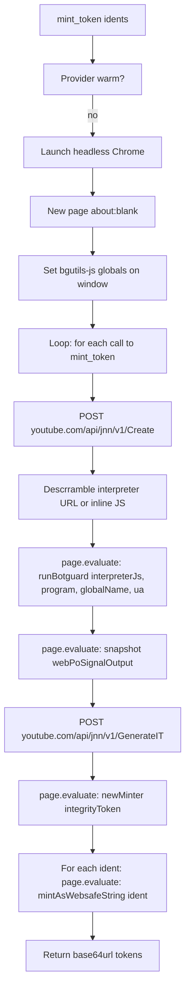

# Chromey-based PoToken provider for rustypipe

## Goal

Add a new PoToken provider that solves the BotGuard challenge in a **real Chrome browser** (via the `chromey` CDP crate) instead of inside Deno+JSDOM (the `rustypipe-botguard` binary). The browser-solved integrity token is what GVS accepts; the Deno+JSDOM-solved one is being rejected on the wire today. The existing botguard binary remains available as a fallback when chromey isn't installed or fails.

The chromey provider only handles PoToken minting; the rest of rustypipe (player requests, SABR body, `StreamerContext.po_token` wire format) is unchanged.

## Non-goals

- Replacing the botguard binary outright. It stays as a fallback.
- Auto-downloading Chrome for Testing. We expect a system Chrome/Chromium (or a user-provided path) to be available.
- A "headless" verification step. The provider launches a real headless browser, so we rely on `chromiumoxide::Browser::launch` to surface any failure.
- A new public `chromey-*` PoToken format. Output is the same base64url-encoded protobuf bytes the botguard binary emits, so the SABR code path doesn't change.

## Design

### Where it lives

Add a new optional feature to the workspace: `chromey-po-token` on the `rustypipe` crate. The chromey-specific code is gated behind this feature so users who don't want a CDP dep don't pull it. The existing `botguard_bin` path stays the default for `PoTokenProvider`.

A single new module — `[src/client/chromey.rs](src/client/chromey.rs)` — contains everything chromey-specific. It exposes a `ChromeyProvider` struct (one Chrome process + one persistent page, lazily launched on first `mint_token` call, kept warm for the lifetime of the `RustyPipe` instance).

### The BotGuard flow as the chromey provider sees it

The botguard binary does this in Deno+JSDOM; we mirror each step, doing the network calls from Rust and the JS execution in the real browser.



The `interpreterJavascript` and `program` from Create are executed in the browser context where `navigator`, `window`, `crypto.getRandomValues`, etc. are real browser APIs. The same `bgutils-js` 3.2.0 code that the botguard binary embeds runs in the browser from a CDN (`https://cdn.jsdelivr.net/npm/bgutils-js@3.2.0/+esm`).

### Public API

Add a builder method on `[RustyPipeBuilder](src/client/mod.rs)` next to `botguard_bin`:

```rust
/// Enable the chromey (real-browser) PoToken provider.
///
/// When enabled, the chromey provider is preferred over the
/// `rustypipe-botguard` binary. If chromey fails to launch or the
/// browser-side BotGuard challenge fails, rustypipe falls back to
/// the botguard binary if it is also configured, otherwise the
/// mint returns an error.
#[must_use]
pub fn chromey_provider(self) -> Self { ... }
```

Two CLI flags, gated on the new feature, in `[cli/src/main.rs](cli/src/main.rs)` next to `botguard_bin`:

```
--chromey                 Use the real-browser (chromey) PoToken provider
--chrome-executable PATH  Path to the Chrome/Chromium binary (default: auto-detect)
--chromey-fallback-botguard  On chromey failure, retry with the botguard binary (default: true)
```

The flag is also a hint to the existing `RUSTYPIPE_SABR_NO_BOTGUARD` env var path: when chromey is enabled and the user has not set `RUSTYPIPE_SABR_NO_BOTGUARD=1`, the downloader's botguard-mint calls go through the chromey path first.

### Integration with the existing `get_po_token` path

`[get_po_tokens](src/client/mod.rs)` (around line 2094) becomes the seam. It currently takes `idents: &[&str]` and shells out to the botguard binary. We add a `PoTokenSource` enum on `BotguardCfg`:

```rust
struct BotguardCfg {
    program: OsString,           // botguard binary path
    version: String,
    snapshot_file: PathBuf,
    po_token_cache: bool,
    chromey: Option<ChromeyProvider>,  // None when feature off or not requested
}
```

`get_po_tokens` prefers `chromey` when `Some` and `chromey.is_healthy()`. On error, it logs and falls through to the botguard binary. The `RustyPipeQuery` already handles botguard errors; the new error is just `ExtractionError::Botguard("chromey: <reason>")` and falls into the same `match` in `player.rs:84`.

### Bridge to the SABR downloader

`[downloader/src/lib.rs](downloader/src/lib.rs)` calls `rp.query().get_po_token(video_id).await` in two places:

1. The "mint a fresh content PO token for SABR init" path (around line 974) — runs once at the start of a SABR download.
2. The "attestation refresh" path inside `mint_attestation_po_token` (around line 1413) — runs up to 10 times per download.

Both go through the new `get_po_tokens`, so they automatically pick up the chromey provider with no changes in the downloader. The `RUSTYPIPE_SABR_NO_BOTGUARD=1` env var disables **both** the chromey and botguard paths in the downloader, leaving only the cold-start fallback. (This matches the current behavior, which already only suppresses the botguard subprocess in the downloader.)

### Headless launch and reuse

The provider holds a single `Browser` + `Page` and reuses them across all `mint_token` calls. This matches the botguard binary's snapshot optimization: the first call solves the challenge and caches the BotGuard VM state in browser memory; subsequent calls re-use it.

We need a small in-process task that drains the chromey event stream (the `chromiumoxide` README pattern of `tokio::task::spawn` on the handler). The provider's `Drop` impl closes the browser gracefully.

Auto-detection order for the Chrome binary (matching the chromey README):
1. `--chrome-executable` CLI value, if set.
2. `RUSTYPIPE_CHROME_EXECUTABLE` env var.
3. `CHROME` env var.
4. Platform-specific well-known paths: `google-chrome`, `google-chrome-stable`, `chromium`, `chromium-browser`, then the macOS `/Applications/Google Chrome.app/Contents/MacOS/Google Chrome`, then `C:\Program Files\Google\Chrome\Application\chrome.exe` on Windows.

A user that has none of these will get a clear "could not find a Chrome/Chromium binary" error from the provider, and the fallback to botguard kicks in (if configured).

## Files to add / change

- `[Cargo.toml](Cargo.toml)` — workspace dep: `chromey = "2.50"`; add `chromey-po-token` to `default = []` of the `rustypipe` crate's `features` table (off by default).
- `[src/client/chromey.rs](src/client/chromey.rs)` — new module, `#[cfg(feature = "chromey-po-token")]`. ~350 lines. Contains:
  - `ChromeyProvider` struct, `new(chrome_path: Option<PathBuf>) -> Result<Self, Error>`
  - `mint(idents: &[&str]) -> Result<Vec<(String, OffsetDateTime)>, Error>` — the equivalent of `get_po_tokens`'s botguard shell-out.
  - A bundled `chromey_runner.js` string (or `include_str!` from `[src/client/chromey_runner.js](src/client/chromey_runner.js)`) containing the BotGuard challenge + minter setup. This is the same JS shape as the botguard binary's `bg_entrypoint.js`, but using `window` instead of JSDOM, and loading `WebPoMinter` from the jsDelivr CDN.
  - `is_healthy()` for the fallback logic.
- `[src/client/mod.rs](src/client/mod.rs)`:
  - Add `chromey_provider: bool` to `RustyPipeBuilder` defaults; add the public `chromey_provider()` method.
  - Add `chrome_executable: Option<PathBuf>` to `RustyPipeBuilder`; add `chrome_executable(p)` method.
  - In `build_with_client`, alongside the existing `botguard` block (around line 623), construct the `ChromeyProvider` and stash it on `BotguardCfg` when the feature is on and `chromey_provider == true`.
  - Change `get_po_tokens` to call `chromey.mint(...)` first, fall back to the botguard binary on error.
  - Re-export `chromey` module behind the feature flag.
- `[src/client/chromey_runner.js](src/client/chromey_runner.js)` — new file. The BotGuard challenge setup + minter wrapper. ~60 lines. Modeled directly on the botguard binary's `bg_entrypoint.js`, but using `window` from the real browser and importing `WebPoMinter` from a CDN.
- `[src/error.rs](src/error.rs)` — add a new variant to `ExtractionError` for chromey-specific failures (timeout, browser launch, JS exception). The existing `Botguard` variant is the natural place to fold these, but a distinct `Chromey(Cow<'static, str>)` makes errors clearer. Mirror the existing `Botguard` variant in shape.
- `[cli/src/main.rs](cli/src/main.rs)` — add the three CLI flags, gated on the `chromey-po-token` rustypipe feature. Wire them onto the builder.
- `[README.md](README.md)` — short paragraph in the "SABR" or "PO tokens" section explaining the new provider, with the env-var/CLI flags.

## Errors and fallbacks

- Chrome binary not found: provider returns `Error::Extraction(ExtractionError::Chromey("chrome not found"))`. The downloader logs a warning and falls back to botguard if `chromey-fallback-botguard` is on, then to cold-start.
- Chrome launch failed: same. Most likely a missing `libnss3.so` or `libgbm.so` on Linux; we surface the OS error.
- `RunBotguard` JS exception (e.g. `botguard challenge failed`): the JS runner returns a structured `{ok: false, error: "..."}` so the Rust side can format it cleanly. Falls back to botguard.
- `GenerateIT` non-200: the chromey path is treated the same as the botguard binary path — 3 retries with exponential backoff, then fall back. Reuse the existing 3-retry loop from `[lib.rs:215](https://codeberg.org/ThetaDev/rustypipe-botguard/src/lib.rs#L215)` of the botguard binary; we copy that retry policy into the chromey provider rather than shelling out.
- `mintAsWebsafeString` returns a non-`String` or an empty string: log + return `Error` from the provider. The downloader's existing error path handles it.

## Validation

End-to-end test the plan's success criterion: `cargo run -p rustypipe-cli -- download "bnhV-OBnGCE" -q audio -o ./music/` with `--chromey` should produce a non-truncated `.webm` file. Without `--chromey`, the same command should still work (botguard path), and its current 60-second-truncation failure should be the same as before this change — chromey is additive, not a regression.

A second test, with `--chromey --no-botguard-fallback`, is the "chromey is the only path" smoke test. It will fail on machines without Chrome, and pass on a workstation with a recent Chrome installed. We don't add a CI job for it (CI doesn't have Chrome); the test is documented in the README as a manual verification step.

## Open questions for the user before I start coding

None remaining. The plan uses:
- chromey added as a workspace dep, optional via the `chromey-po-token` feature on the `rustypipe` crate.
- Public builder method `RustyPipeBuilder::chromey_provider()` (matching the user's "rustypipe_chromey_provider" answer).
- Provider-only scope (chromey sits next to botguard, doesn't replace it).
- System Chrome only, with the standard chromey auto-detect plus a `--chrome-executable` escape hatch.
- chromey is preferred over botguard when both are configured, with botguard as the fallback. (This is the natural default and matches what yt-dlp's `bgutil-ytdlp-pot-provider` does.)
