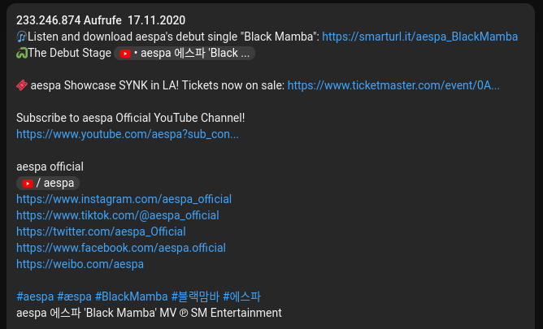
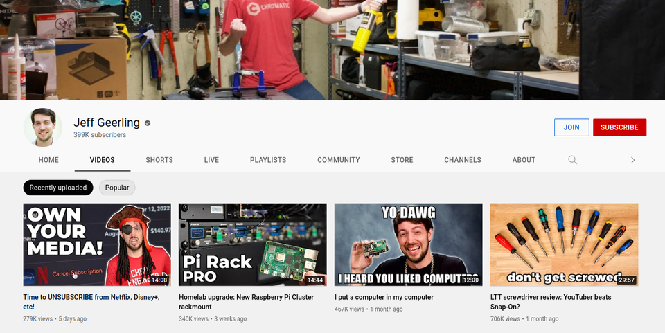
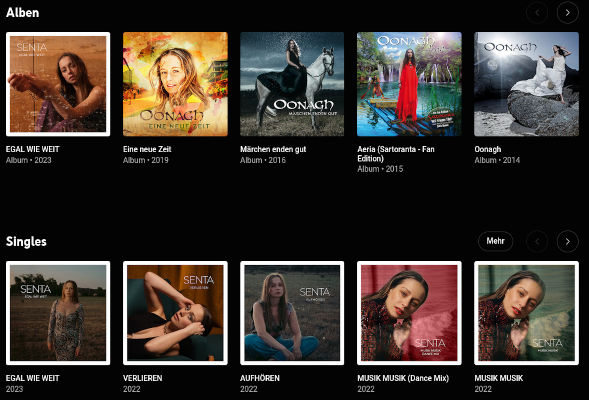
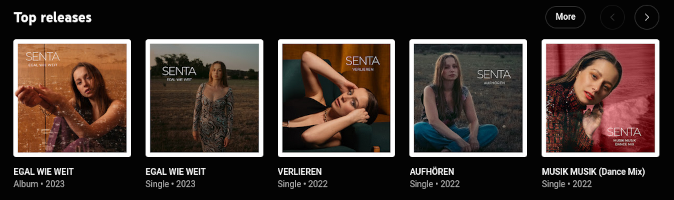
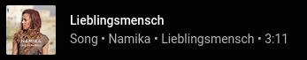
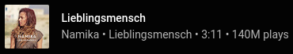
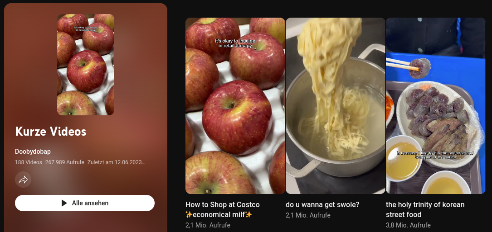
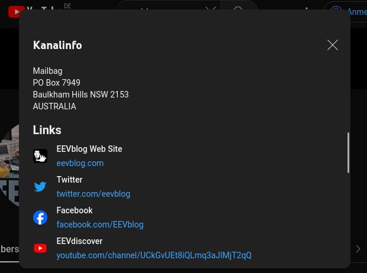
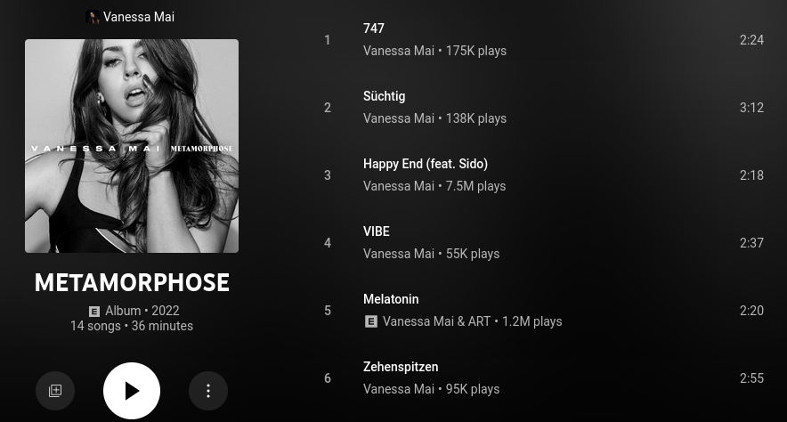

# A/B-Tests

When YouTube introduces a new feature, it does so gradually. When a user creates a new
session, YouTube decided randomly which new features should be enabled.

YouTube sessions are identified by the visitor data cookie. This cookie is sent with
every API request using the `context.client.visitor_data` JSON parameter. It is also
returned in the `responseContext.visitorData` response parameter and stored as the
`__SECURE-YEC` cookie.

By sending the same visitor data cookie, A/B tests can be reproduced, which is important
for testing alternative YouTube clients.

This page lists all A/B tests that were encountered while maintaining the RustyPipe
client.

**Impact rating:**

The impact ratings shows how much effort it takes to adapt alternative YouTube clients
to the new feature.

- 🟢 **Low** Minor incompatibility (e.g. parameter name change)
- 🟡 **Medium** Extensive changes to the response data model OR removal of parameters
- 🔴 **High** Changes to the functionality of YouTube that will require API changes for
  alternative clients

**Status:**

- Discontinued (0%)
- Experimental (<3%)
- Common (>3%)
- Frequent (>40%)
- Stabilized (100%)

If you want to check how often these A/B tests occur, you can use the `codegen` tool
with the following command: `rustypipe-codegen ab-test <id>`.

## [1] Attributed text description

- **Encountered on:** 24.09.2022
- **Impact:** 🟡 Medium
- **Endpoint:** next (video details)
- **Status:** Stabilized



YouTube shows internal links (channels, videos, playlists) in the video description as
buttons with the YouTube icon. To accomplish this, they completely changed the
underlying data model.

The new format uses a string with the entire plaintext content along with a list of
`"commandRuns"` which include the link data and the position of the links within the
text.

Note that the position and length parameter refer to the number of UTF-16 characters. If
you are implementing this in a language which does not use UTF-16 as its internal string
representation, you have to iterate over the unicode codepoints and keep track of the
UTF-16 index seperately.

**OLD**

```json
{
  "videoSecondaryInfoRenderer": {
    "description": {
      "runs": [
        {
          "text": "🎧Listen and download aespa's debut single \"Black Mamba\": "
        },
        {
          "navigationEndpoint": {
            "commandMetadata": {
              "webCommandMetadata": {
                "rootVe": 83769,
                "url": "https://www.youtube.com/redirect?...",
                "webPageType": "WEB_PAGE_TYPE_UNKNOWN"
              }
            },
            "urlEndpoint": {
              "nofollow": true,
              "target": "TARGET_NEW_WINDOW",
              "url": "https://www.youtube.com/redirect?..."
            }
          },
          "text": "https://smarturl.it/aespa_BlackMamba"
        }
      ]
    }
  }
}
```

**NEW**

```json
{
  "videoSecondaryInfoRenderer": {
    "attributedDescription": {
      "content": "🎧Listen and download aespa's debut single \"Black Mamba\": https://smarturl.it/aespa_BlackMamba\n🐍The Debut Stage...",
      "commandRuns": [
        {
          "startIndex": 58,
          "length": 36,
          "onTap": {
            "innertubeCommand": {
              "commandMetadata": {
                "webCommandMetadata": {
                  "url": "https://www.youtube.com/redirect?...",
                  "webPageType": "WEB_PAGE_TYPE_UNKNOWN",
                  "rootVe": 83769
                }
              },
              "urlEndpoint": {
                "url": "https://www.youtube.com/redirect?...",
                "target": "TARGET_NEW_WINDOW",
                "nofollow": true
              }
            }
          }
        }
      ]
    }
  }
}
```

## [2] 3-tab channel layout

- **Announced:** 15.09.2022, https://www.youtube.com/watch?v=czIyqEC4V-s
- **Encountered on:** 11.10.2022
- **Impact:** 🔴 High
- **Endpoint:** browse (channel videos)
- **Status:** Stabilized



YouTube changed their channel page layout, putting livestreams and short videos into
separate tabs.

Fetching the videos page now only returns a subset of a channel's videos. To get all
videos from a channel, you would have to run up to 3 queries.

Even though it has its disadvantages, the RSS feed is now probably the best way for
keeping track of a channel's new uploads.

Additionally the channel tab response model was slightly changed, now using a
`"RichGridRenderer"`. Short videos also have their own data models
(`"reelItemRenderer"`).

**RichGrid**

```json
{
  "tabRenderer": {
    "content": {
      "richGridRenderer": {
        "contents": [
          {
            "richItemRenderer": {
              "content": {
                "videoRenderer": {}
              }
            }
          }
        ]
      }
    }
  }
}
```

**Short video**

```json
{
  "reelItemRenderer": {
    "accessibility": {
      "accessibilityData": {
        "label": "being smart was my personality trait - 56 seconds - play video"
      }
    },
    "headline": {
      "simpleText": "being smart was my personality trait"
    },
    "navigationEndpoint": {
      "clickTrackingParams": "CLcCEIf2BBgAIhMImuP85t-D-wIVd-sRCB2r6gl7",
      "commandMetadata": {
        "webCommandMetadata": {
          "rootVe": 37414,
          "url": "/shorts/glyJWxp7a5g",
          "webPageType": "WEB_PAGE_TYPE_SHORTS"
        }
      },
      "reelWatchEndpoint": {
        "overlay": {
          "reelPlayerOverlayRenderer": {
            "reelPlayerHeaderSupportedRenderers": {
              "reelPlayerHeaderRenderer": {
                "timestampText": {
                  "simpleText": "2 days ago"
                }
              }
            }
          }
        }
      }
    },
    "thumbnail": {
      "thumbnails": [
        {
          "height": 720,
          "url": "https://i.ytimg.com/vi/glyJWxp7a5g/hq720_2.jpg?sqp=-oaymwEdCJUDENAFSFXyq4qpAw8IARUAAIhCcAHAAQbQAQE=&rs=AOn4CLCUzo9AlrNh4n4cZfTOB8_Gf5aAkw",
          "width": 405
        }
      ]
    },
    "videoId": "glyJWxp7a5g",
    "viewCountText": {
      "simpleText": "593K views"
    }
  }
}
```

## [3] Channel handles in search results

- **Encountered on:** 20.11.2022
- **Impact:** 🟡 Medium
- **Endpoint:** search
- **Status:** Stabilized


Instead of subscriber count / video count, a channel item from the search result now
displays the channel handle and the subscriber count. The video count was removed.

The implementation looks pretty quick and dirty, as they did not even bother to rename
their response parameters. So this might change again in the future.

Note that channels without handles still use the old data model, even on the same page.

**OLD**

```json
{
  "subscriberCountText": {
    "accessibility": {
      "accessibilityData": {
        "label": "2.92 million subscribers"
      }
    },
    "simpleText": "2.92M subscribers"
  },
  "videoCountText": {
    "runs": [
      {
        "text": "219"
      },
      {
        "text": " videos"
      }
    ]
  }
}
```

**NEW**

```json
{
  "videoCountText": {
    "accessibility": {
      "accessibilityData": {
        "label": "4.03 million subscribers"
      }
    },
    "simpleText": "4.03M subscribers"
  },
  "subscriberCountText": {
    "simpleText": "@MusicTravelLove"
  }
}
```

## [4] Video tab on the Trending page

- **Encountered on:** 1.04.2023
- **Impact:** 🟢 Low
- **Endpoint:** browse (trending videos)
- **Status:** Discontinued

YouTube moved the list of trending videos from the main _trending_ page to a separate
tab (Videos).

The video tab is fetched with the params `4gIOGgxtb3N0X3BvcHVsYXI%3D`.

This new tab contains two shelves (video lists), the first one labeled "Trending videos"
which contains the regular trends and the second one named "Recently trending".

The data model for the video shelves did not change.

**OLD**


**NEW**


## [5] Page header renderer on the Trending page

- **Encountered on:** 1.05.2023
- **Impact:** 🟢 Low
- **Endpoint:** browse (trending videos)
- **Status:** Stabilized

YouTube changed the header renderer type on the trending page to a `pageHeaderRenderer`.

**OLD**

```json
{
  "c4TabbedHeaderRenderer": {
    "avatar": {
      "thumbnails": [
        {
          "height": 100,
          "url": "https://www.youtube.com/img/trending/avatar/trending_avatar.png",
          "width": 100
        }
      ]
    },
    "title": "Trending",
    "trackingParams": "CBAQ8DsiEwiXi_iUht76AhVM6hEIHfgTB2g="
  }
}
```

**NEW**

```json
{
  "pageHeaderRenderer": {
    "pageTitle": "Trending",
    "content": {
      "pageHeaderViewModel": {
        "title": {
          "dynamicTextViewModel": { "text": { "content": "Trending" } }
        },
        "image": {
          "contentPreviewImageViewModel": {
            "image": {
              "sources": [
                {
                  "url": "https://www.youtube.com/img/trending/avatar/trending.png",
                  "width": 100,
                  "height": 100
                }
              ]
            },
            "style": "CONTENT_PREVIEW_IMAGE_STYLE_CIRCLE"
          }
        }
      }
    }
  }
}
```

## [6] New Music Discography page

- **Encountered on:** 13.05.2023
- **Impact:** 🟡 Medium
- **Endpoint:** browse (music artist)
- **Status:** Stabilized

YouTube merged the 2 sections for singles and albums on artist pages together. Now there
is only a _Top Releases_ section.

YouTube also changed the way the full discography page is fetched, surprisingly making
it easier for alternative clients. The discography page now has its own content ID in
the format of `MPAD<channel id>` (Music Page Artist Discography). This page can be
fetched with a regular browse request without requiring parameters to be parsed or a
visitor data cookie to be set, as it was the case with the old system.

**OLD**



**NEW**



## [7] Short timeago format

- **Encountered on:** 28.05.2023
- **Impact:** 🟢 Low
- **Status:** Discontinued

YouTube changed their date format from the long format (_21 hours ago_, _3 days ago_) to
a short format (_21h ago_, _3d ago_).

## [8] Track playback count in search results and artist views

- **Encountered on:** 29.06.2023
- **Impact:** 🟡 Medium
- **Status:** Stabilized

YouTube added the track playback count to search results and top artist tracks. In
exchange, they removed the "Song" type identifier from search results.





## [9] Playlists for Shorts

- **Encountered on:** 26.06.2023
- **Impact:** 🟡 Medium
- **Endpoint:** browse (playlist)
- **Status:** Stabilized



Original issue: https://github.com/TeamNewPipe/NewPipeExtractor/issues/10774

YouTube added a filter system for playlists, allowing users to only see shorts/full
videos.

When shorts filter is enabled or when there are only shorts in a playlist, YouTube
return shorts UI elements instead of standard video ones, the ones that are also used
for shorts shelves in searches and suggestions and shorts in the corresponding channel
tab.

Since the reel items dont include upload date information you can circumvent this new UI
by using the mobile client. But that may change in the future.

## [10] Channel About modal

- **Encountered on:** 03.11.2023
- **Impact:** 🟡 Medium
- **Endpoint:** browse (channel info)
- **Status:** Stabilized



YouTube replaced the _About_ channel tab with a modal. This changes the way additional
channel metadata has to be fetched.

The new modal uses a continuation request with a token which can be easily generated.
Attempts to fetch the old about tab with the A/B test enabled will lead to a redirect to
the main tab.

## [11] Like-Button viewmodel

- **Encountered on:** 03.11.2023
- **Impact:** 🟢 Low
- **Endpoint:** next
- **Status:** Stabilized

YouTube introduced an updated data model for the like/dislike buttons. The new model
looks needlessly complex but contains the same parsing-relevant data as the old model
(accessibility text to get like count).

```json
{
  "segmentedLikeDislikeButtonViewModel": {
    "likeButtonViewModel": {
      "likeButtonViewModel": {
        "toggleButtonViewModel": {
          "toggleButtonViewModel": {
            "defaultButtonViewModel": {
              "buttonViewModel": {
                "iconName": "LIKE",
                "title": "4.2M",
                "accessibilityText": "like this video along with 4,209,059 other people"
              }
            }
          }
        }
      }
    }
  }
}
```

## [12] New channel page header

- **Encountered on:** 29.01.2024
- **Impact:** 🟢 Low
- **Endpoint:** browse
- **Status:** Stabilized

YouTube introduced a new data model for channel headers, based on a
`"pageHeaderRenderer"`. The new model comes with more needless complexity that needs to
be accomodated. There are also no mobile/TV header images available any more.

```json
{
  "pageHeaderViewModel": {
    "title": {
      "dynamicTextViewModel": {
        "text": {
          "content": "Doobydobap",
          "attachmentRuns": [
            {
              "startIndex": 10,
              "length": 0,
              "element": {
                "type": {
                  "imageType": {
                    "image": {
                      "sources": [
                        {
                          "clientResource": {
                            "imageName": "CHECK_CIRCLE_FILLED"
                          },
                          "width": 14,
                          "height": 14
                        }
                      ]
                    }
                  }
                }
              }
            }
          ]
        }
      }
    },
    "image": {
      "decoratedAvatarViewModel": {
        "avatar": {
          "avatarViewModel": {
            "image": {
              "sources": [
                {
                  "url": "https://yt3.googleusercontent.com/dm5Aq93xvVJz0NoVO88ieBkDXmuShCujGPlZ7qETMEPTrXvPUCFI3-BB6Xs_P-r6Uk3mnBy9zA=s72-c-k-c0x00ffffff-no-rj",
                  "width": 72,
                  "height": 72
                }
              ]
            }
          }
        }
      }
    },
    "metadata": {
      "contentMetadataViewModel": {
        "metadataRows": [
          {
            "metadataParts": [
              {
                "text": {
                  "content": "@Doobydobap"
                }
              },
              {
                "text": {
                  "content": "3.74M subscribers"
                }
              },
              {
                "text": {
                  "content": "345 videos",
                  "styleRuns": [
                    {
                      "startIndex": 0,
                      "length": 10
                    }
                  ]
                }
              }
            ]
          }
        ]
      }
    },
    "banner": {
      "imageBannerViewModel": {
        "image": {
          "sources": [
            {
              "url": "https://yt3.googleusercontent.com/BvnAqgiursrXpmS9AgDLtkOSTQfOG_Dqn0KzY5hcwO9XrHTEQTVgaflI913f9KRp7d0U2qBp=w1060-fcrop64=1,00005a57ffffa5a8-k-c0xffffffff-no-nd-rj",
              "width": 1060,
              "height": 175
            }
          ]
        }
      }
    }
  }
}
```

## [13] Music album/playlist 2-column layout

- **Encountered on:** 29.02.2024
- **Impact:** 🟢 Low
- **Endpoint:** browse
- **Status:** Stabilized



YouTube Music updated the layout of album and playlist pages. The new layout shows the
cover on the left side of the playlist content.

## [14] Comments Framework update

- **Encountered on:** 31.01.2024
- **Impact:** 🟢 Low
- **Endpoint:** next
- **Status:** Stabilized

YouTube changed the data model for YouTube comments, now putting the content into a
seperate framework update object

```json
{
  "frameworkUpdates": {
    "onResponseReceivedEndpoints": [
      {
        "clickTrackingParams": "CAAQg2ciEwi64q3dmKGFAxWvy0IFHc14BKM=",
        "reloadContinuationItemsCommand": {
          "targetId": "comments-section",
          "continuationItems": [
            {
              "commentThreadRenderer": {
                "replies": {
                  "commentRepliesRenderer": {
                    "contents": [
                      {
                        "continuationItemRenderer": {
                          "trigger": "CONTINUATION_TRIGGER_ON_ITEM_SHOWN",
                          "continuationEndpoint": {
                            "clickTrackingParams": "CHgQvnUiEwi64q3dmKGFAxWvy0IFHc14BKM=",
                            "commandMetadata": {
                              "webCommandMetadata": {
                                "sendPost": true,
                                "apiUrl": "/youtubei/v1/next"
                              }
                            },
                            "continuationCommand": {
                              "token": "Eg0SC1FpcDFWa1R1TTcwGAYygwEaUBIaVWd5TlRUOHV4REVqZ1lxeWJJRjRBYUFCQWciAggAKhhVQ3lhZmx6ek9IMEdDNjgzRGxRLWZ6d2cyC1FpcDFWa1R1TTcwQAFICoIBAggBQi9jb21tZW50LXJlcGxpZXMtaXRlbS1VZ3lOVFQ4dXhERWpnWXF5YklGNEFhQUJBZw%3D%3D",
                              "request": "CONTINUATION_REQUEST_TYPE_WATCH_NEXT"
                            }
                          }
                        }
                      }
                    ],
                    "trackingParams": "CHgQvnUiEwi64q3dmKGFAxWvy0IFHc14BKM=",
                    "viewReplies": {
                      "buttonRenderer": {
                        "text": { "runs": [{ "text": "220 replies" }] },
                        "icon": { "iconType": "ARROW_DROP_DOWN" },
                        "trackingParams": "CHoQosAEIhMIuuKt3ZihhQMVr8tCBR3NeASj",
                        "iconPosition": "BUTTON_ICON_POSITION_TYPE_LEFT_OF_TEXT"
                      }
                    },
                    "hideReplies": {
                      "buttonRenderer": {
                        "text": { "runs": [{ "text": "220 replies" }] },
                        "icon": { "iconType": "ARROW_DROP_UP" },
                        "trackingParams": "CHkQ280EIhMIuuKt3ZihhQMVr8tCBR3NeASj",
                        "iconPosition": "BUTTON_ICON_POSITION_TYPE_LEFT_OF_TEXT"
                      }
                    },
                    "targetId": "comment-replies-item-UgyNTT8uxDEjgYqybIF4AaABAg"
                  }
                },
                "trackingParams": "CHYQwnUYywEiEwi64q3dmKGFAxWvy0IFHc14BKM=",
                "renderingPriority": "RENDERING_PRIORITY_PINNED_COMMENT",
                "isModeratedElqComment": false,
                "commentViewModel": {
                  "commentViewModel": {
                    "commentId": "UgyNTT8uxDEjgYqybIF4AaABAg"
                  }
                }
              }
            }
          ]
        }
      }
    ],
    "entityBatchUpdate": {
      "mutations": [
        {
          "entityKey": "EhpVZ3lOVFQ4dXhERWpnWXF5YklGNEFhQUJBZyAoKAE%3D",
          "type": "ENTITY_MUTATION_TYPE_REPLACE",
          "payload": {
            "commentEntityPayload": {
              "key": "EhpVZ3lOVFQ4dXhERWpnWXF5YklGNEFhQUJBZyAoKAE%3D",
              "properties": {
                "commentId": "UgyNTT8uxDEjgYqybIF4AaABAg",
                "content": {
                  "content": "⚠️ Important notice: if you put any symbol immediately after markup, it will not work: *here is the comma*, without space.\n\nYou should leave space before and after , to make it work.\n\nSame for _underscore_, and -hyphen-.\n\nLeave space before opening and after closing underscore and hyphen. Put all dots and commas inside markup.",
                  "styleRuns": [
                    {
                      "startIndex": 135,
                      "length": 28,
                      "weightLabel": "FONT_WEIGHT_MEDIUM"
                    },
                    {
                      "startIndex": 267,
                      "length": 10,
                      "weightLabel": "FONT_WEIGHT_NORMAL",
                      "italic": true
                    },
                    {
                      "startIndex": 282,
                      "length": 7,
                      "weightLabel": "FONT_WEIGHT_NORMAL",
                      "strikethrough": "LINE_STYLE_SINGLE"
                    }
                  ]
                },
                "publishedTime": "2 years ago (edited)",
                "replyLevel": 0,
                "authorButtonA11y": "@kibizoid",
                "toolbarStateKey": "EhpVZ3lOVFQ4dXhERWpnWXF5YklGNEFhQUJBZyAsKAE%3D",
                "translateButtonEntityKey": "EhpVZ3lOVFQ4dXhERWpnWXF5YklGNEFhQUJBZyD_ASgB"
              },
              "author": {
                "channelId": "UCUJfyiofeHQTmxKwZ6cCwIg",
                "displayName": "@kibizoid",
                "avatarThumbnailUrl": "https://yt3.ggpht.com/ytc/AIdro_nY2PkIyojDqs9Bk5RY6J90-U7wePswTYl799DNJQ=s88-c-k-c0x00ffffff-no-rj",
                "isVerified": false,
                "isCurrentUser": false,
                "isCreator": false,
                "isArtist": false
              },
              "avatar": {
                "image": {
                  "sources": [
                    {
                      "url": "https://yt3.ggpht.com/ytc/AIdro_nY2PkIyojDqs9Bk5RY6J90-U7wePswTYl799DNJQ=s88-c-k-c0x00ffffff-no-rj",
                      "width": 88,
                      "height": 88
                    }
                  ]
                }
              }
            }
          }
        }
      ]
    }
  }
}
```

## [15] Channel shorts: shortsLockupViewModel

- **Encountered on:** 10.09.2024
- **Impact:** 🟢 Low
- **Endpoint:** browse
- **Status:** Stabilized

YouTube changed the data model for the channel shorts tab

```json
{
  "richItemRenderer": {
    "content": {
      "shortsLockupViewModel": {
        "entityId": "shorts-shelf-item-ovaHmfy3O6U",
        "accessibilityText": "hangover food, 17 million views - play Short",
        "thumbnail": {
          "sources": [
            {
              "url": "https://i.ytimg.com/vi/ovaHmfy3O6U/oar2.jpg?sqp=-oaymwEdCJUDENAFSFWQAgHyq4qpAwwIARUAAIhCcAHAAQY=&rs=AOn4CLBg-kG4rAi-BQ8Xkp2hOtOu-oXDLQ",
              "width": 405,
              "height": 720
            }
          ]
        },
        "overlayMetadata": {
          "primaryText": {
            "content": "hangover food"
          },
          "secondaryText": {
            "content": "17M views"
          }
        }
      }
    }
  }
}
```

## [16] New playlist header renderer

- **Encountered on:** 11.10.2024
- **Impact:** 🟢 Low
- **Endpoint:** browse
- **Status:** Stabilized

```json
{
  "pageHeaderRenderer": {
    "pageTitle": "LilyPichu",
    "content": {
      "pageHeaderViewModel": {
        "title": {
          "dynamicTextViewModel": {
            "text": {
              "content": "LilyPichu"
            }
          }
        },
        "metadata": {
          "contentMetadataViewModel": {
            "metadataRows": [
              {
                "metadataParts": [
                  {
                    "avatarStack": {
                      "avatarStackViewModel": {
                        "avatars": [
                          {
                            "avatarViewModel": {
                              "image": {
                                "sources": [
                                  {
                                    "url": "https://yt3.ggpht.com/ytc/AIdro_kcjhSY2e8WlYjQABOB65Za8n3QYycNHP9zXwxjKpBfOg=s48-c-k-c0x00ffffff-no-rj",
                                    "width": 48,
                                    "height": 48
                                  }
                                ]
                              }
                            }
                          }
                        ],
                        "text": {
                          "content": "by Kevin Ramirez",
                          "commandRuns": [
                            {
                              "startIndex": 0,
                              "length": 16,
                              "onTap": {
                                "innertubeCommand": {
                                  "browseEndpoint": {
                                    "browseId": "UCai7BcI5lrXC2vdc3ySku8A",
                                    "canonicalBaseUrl": "/@XxthekevinramirezxX"
                                  }
                                }
                              }
                            }
                          ]
                        }
                      }
                    }
                  }
                ]
              },
              {
                "metadataParts": [
                  {
                    "text": {
                      "content": "Playlist"
                    }
                  },
                  {
                    "text": {
                      "content": "10 videos"
                    }
                  },
                  {
                    "text": {
                      "content": "856 views"
                    }
                  }
                ]
              }
            ]
          }
        },
        "actions": {},
        "description": {
          "descriptionPreviewViewModel": {
            "description": { "content": "Hello World" }
          }
        },
        "heroImage": {
          "contentPreviewImageViewModel": {
            "image": {
              "sources": [
                {
                  "url": "https://i.ytimg.com/vi/DXuNJ267Vss/hqdefault.jpg?sqp=-oaymwEWCKgBEF5IWvKriqkDCQgBFQAAiEIYAQ==&rs=AOn4CLAHp6V96b70x4SWm9Pe6WEHnQhP6A",
                  "width": 168,
                  "height": 94
                }
              ]
            }
          }
        }
      }
    }
  }
}
```

## [17] Channel playlists: lockupViewModel

- **Encountered on:** 09.11.2024
- **Impact:** 🟢 Low
- **Endpoint:** browse
- **Status:** Stabilized

YouTube changed the data model for the channel playlists / podcasts / albums tab

```json
{
  "lockupViewModel": {
    "contentImage": {
      "collectionThumbnailViewModel": {
        "primaryThumbnail": {
          "thumbnailViewModel": {
            "image": {
              "sources": [
                {
                  "url": "https://i.ytimg.com/vi/XYdmX8w8xwI/hqdefault.jpg?sqp=-oaymwEXCOADEI4CSFryq4qpAwkIARUAAIhCGAE=&rs=AOn4CLCqmf6TGfDinNXhgU29ZxOkv2u9sQ",
                  "width": 480,
                  "height": 270
                }
              ]
            },
            "overlays": [
              {
                "thumbnailOverlayBadgeViewModel": {
                  "thumbnailBadges": [
                    {
                      "thumbnailBadgeViewModel": {
                        "icon": {
                          "sources": [
                            {
                              "clientResource": {
                                "imageName": "PLAYLISTS"
                              }
                            }
                          ]
                        },
                        "text": "5 videos",
                        "badgeStyle": "THUMBNAIL_OVERLAY_BADGE_STYLE_DEFAULT",
                        "backgroundColor": {
                          "lightTheme": 2370867,
                          "darkTheme": 2370867
                        }
                      }
                    }
                  ],
                  "position": "THUMBNAIL_OVERLAY_BADGE_POSITION_BOTTOM_END"
                }
              }
            ]
          }
        }
      }
    },
    "metadata": {
      "lockupMetadataViewModel": {
        "title": {
          "content": "Jellybean Components Series"
        }
      }
    },
    "contentId": "PLvOlSehNtuHv268f0mW5m1t_hq_RVGRSA",
    "contentType": "LOCKUP_CONTENT_TYPE_PLAYLIST"
  }
}
```

## [18] Music playlists facepile avatar

- **Encountered on:** 25.11.2024
- **Impact:** 🟢 Low
- **Endpoint:** browse (YTM)
- **Status:** Stabilized

YouTube changed the data model for the channel playlist owner avatar into a `facepile`
object. It now also contains the channel avatar.

The model is also used for playlists owned by YouTube Music (with the avatar and
commandContext missing).

```json
{
  "facepile": {
    "avatarStackViewModel": {
      "avatars": [
        {
          "avatarViewModel": {
            "image": {
              "sources": [
                {
                  "url": "https://yt3.ggpht.com/ytc/AIdro_n9ALaLETwQH6_2WlXitIaIKV-IqBDWWquvyI2jucNAZaQ=s48-c-k-c0x00000000-no-cc-rj-rp"
                }
              ]
            },
            "avatarImageSize": "AVATAR_SIZE_XS"
          }
        }
      ],
      "text": {
        "content": "Chaosflo44"
      },
      "rendererContext": {
        "commandContext": {
          "onTap": {
            "innertubeCommand": {
              "browseEndpoint": {
                "browseId": "UCQM0bS4_04-Y4JuYrgmnpZQ",
                "browseEndpointContextSupportedConfigs": {
                  "browseEndpointContextMusicConfig": {
                    "pageType": "MUSIC_PAGE_TYPE_USER_CHANNEL"
                  }
                }
              }
            }
          }
        }
      }
    }
  }
}
```
